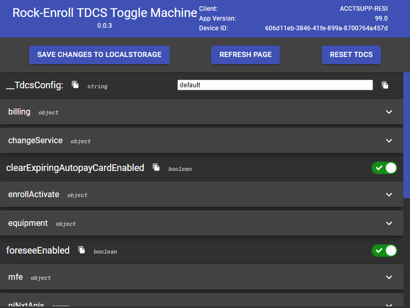

# TDCS Edit Tool - Chrome Extension

## Features

- Dark and Light mode
- Easily change TDCS toggles locally and refresh the browser to see them take affect
- Handy copy buttons for toggle names and values

## How to use

- Navigate through the TDCS object in the extension popup and change the toggles you want
- Save your changes to local storage with the button at the top of the popup
- Refresh the page for the app to see the new values

## Installing
1. Go to the [Releases](https://github.com/JCron245/tdcs-edit-extension/releases) for this repo.
2. Grab the latest version (or whichever version you prefer)
3. Download and unzip the attached build zip
4. Install the extension in Chrome by following:
   1. Access `chrome://extensions/`
   2. Check `Developer mode`
   3. Click on `Load unpacked extension`
   4. Select the unzipped `build` folder.

## Running Locally

1. Check if your [Node.js](https://nodejs.org/) version is >= **14**.
2. Clone this repository.
3. Navigate into new repo.
4. Run `npm install` to install the dependencies.
5. Run `npm start` for development or `npm run build` for a single install
6. Load your extension on Chrome following:
   1. Access `chrome://extensions/`
   2. Check `Developer mode`
   3. Click on `Load unpacked extension`
   4. Select the `build` folder.
